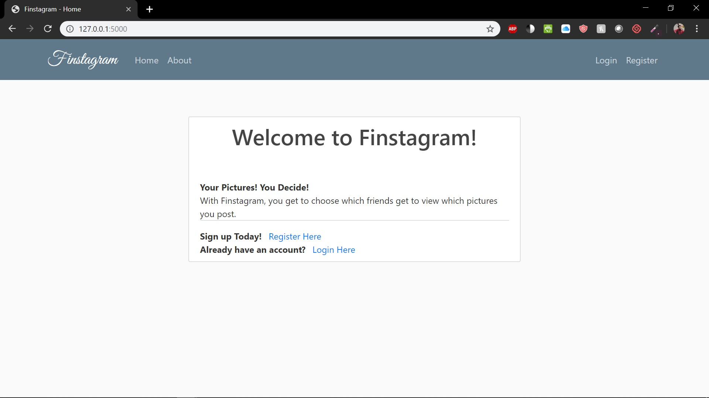
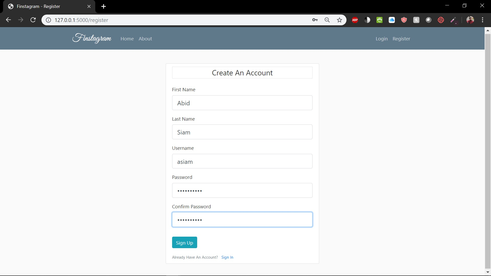
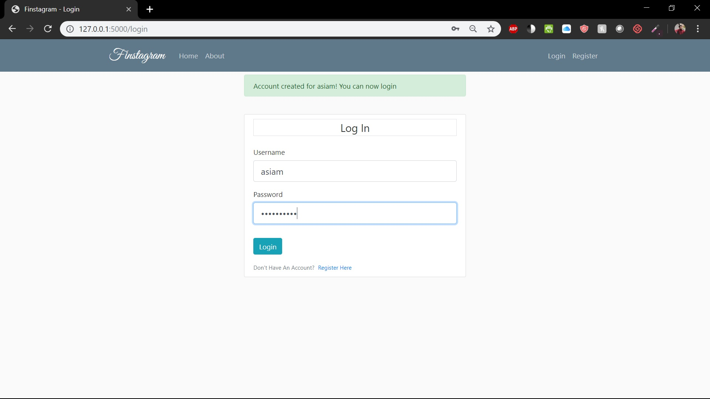
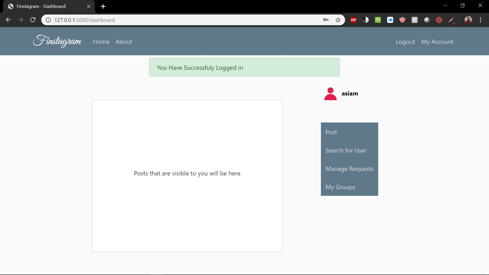
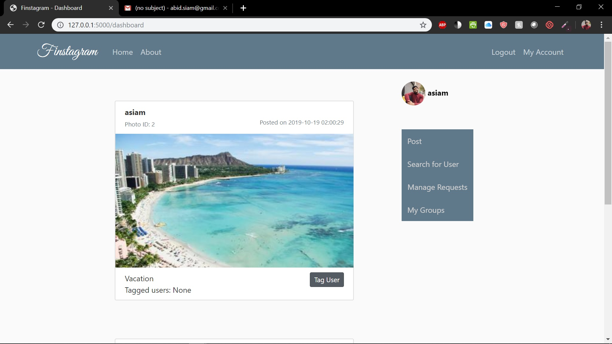

# Finstagram
## Project Overview 
Finstagram is a web application for sharing photos. Finstagram gives users more privacy than many photo sharing sites by giving them more detailed control over who can see which photos they post. Users will be able to log in, post photos, view (some of) the photos posted by others (public photos, photos posted by people they are 'following', and close friends, detailed below); 'tag' photos items with handles of people, etc. 
## Features
1. **Login:** The user enters her username and password. Finstagram will add “salt” to the password, hash it, and check whether the hash of the password matches the stored password for that e-mail. If so, it initiates a session, storing the username and any other relevant data in session variables, then goes to the home page (or provides some mechanism for the user to select her next action.) If the password does not match the stored password for that username (or no such user exists) Finstagram informs the user that the the login failed and does not initiate the session.
2. **View visible photos and info about them:** Finstagram shows the user the photoID, photoOwner’s name, and caption of photos that are visible to the her, arranged in reverse chronological order. Display the photo or include a link to display it. Along with each photo the following further information should be displayed or there should be an option to display it: timestamp, the first names and last names of people who have been tagged in the photo (taggees), provided that they have accepted the tags (Tag.acceptedTag == true) 
3. **Post a photo:** User enters the relevant data and a link to a real photo and a designation of whether the photo is visible to all followers (allFollowers == true) or only to members of designated CloseFriendGroups (allFollowers == false). Finstagram inserts data about the photo (including current time, and current user as owner) into the Photo table. If the photo is not visible to all followers, Finstagram gives the user a way to designate CloseFriendGroups that the user belongs to with which the Photo is shared. 
4. **Manage Follows:**
  a. User enters the username of someone they want to follow. Finstagram adds an appropriate tuple to Follow, with acceptedFollow == False. 
  b. User sees list of requests others has made to follow them and has opportunity to accept, by setting acceptFollow to True or to decline by removing the request from the Follow table. 
5. **Manage tag requests:** Finstagram shows the user relevant data about photos that have proposed tags of this user (i.e. user is the taggee and acceptedTag is false.) User can choose to accept a tag (change acceptedTag to true), decline a tag (remove the tag from Tag table), or not make a decision (leave the proposed tag in the table with acceptedTag == false.) 
6. **Tag a photo:** Current user, whom we’ll call x, selects a photo that is visible to her and proposes to tag it with username y 
i. If the user is self-tagging (y == x), Finstagram adds a row to the Tag table: (x, photoID, true) ii. else if the photo is visible to y, Finstagram adds a row to the Tag table: (y, photoID, false) iii. else if photo is not visible to y, Finstagram doesn’t change the tag table 
and prints some message saying that she cannot propose this tag. 
7. **Add friend:** User selects an existing CloseFriendGroup that they own and provides 
username of someone she’d like to add to the group. Finstagram checks whether there is exactly one person with that name and updates the Belong table to indicate that the selected person is now in the CloseFriendGroup. 
## Prerequisites
#### Python
Download latest version of Python here: https://www.python.org/downloads/
#### MySQL Server with Finstagram Database
I am running MySQL server using WAMPserver64. Once installed, add a new database 'finstagram' with charset 'utf8mb4'. Next, insert and run the queries from the **ProjectQueries.sql** file.
## Samples
#### Welcome Page

#### Create Account Page

#### Login Page

#### Home Page

#### Updated with Post and Profile Picture

